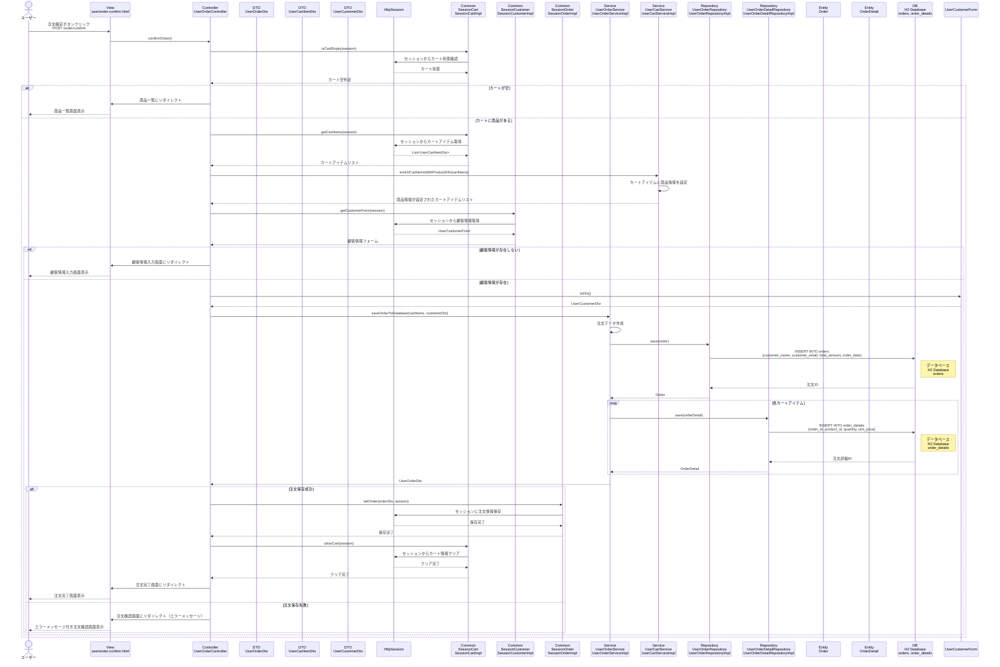

# シーケンス図_注文確定

## 概要
注文確定機能のシーケンス図です。注文を確定し、データベースに保存する際の処理フローを示します。

## シーケンス図

## 解説

### 処理フロー
1. **ユーザーアクション**: ユーザーが注文確認画面で「注文確定」ボタンをクリック
2. **POSTリクエスト**: 注文確定処理をPOSTで送信（`/order/confirm`）
3. **コントローラー処理**: `UserOrderController.confirmOrder()`メソッドが実行される
4. **カート確認**: `SessionCart.isCartEmpty()`でカートが空かチェック
5. **カート空判定**: カートが空の場合は商品一覧にリダイレクト
6. **カートアイテム取得**: `SessionCart.getCartItems()`でセッションからカートアイテムを取得
7. **商品情報設定**: `UserCartService.enrichCartItemsWithProductInfo()`でカートアイテムに商品詳細情報を設定
8. **顧客情報取得**: `SessionCustomer.getCustomerForm()`でセッションから顧客情報を取得
9. **顧客情報確認**: 顧客情報が存在しない場合は顧客情報入力画面にリダイレクト
10. **DTO変換**: `UserCustomerForm.toDto()`でフォームをDTOに変換
11. **注文保存**: `UserOrderService.saveOrderToDatabase()`で注文をデータベースに保存
12. **注文テーブル保存**: `UserOrderRepository.save()`で注文情報をordersテーブルに保存
13. **注文詳細保存**: 各カートアイテムを`UserOrderDetailRepository.save()`でorder_detailsテーブルに保存
14. **セッション更新**: 注文情報をセッションに保存し、カートをクリア
15. **画面遷移**: 成功時は注文完了画面、失敗時はエラーメッセージ付き注文確認画面に遷移

### 主要なクラスと役割
- **UserOrderController**: リクエストを受け取り、注文確定処理を統括
- **UserOrderService**: 注文データの作成とデータベース保存を担当
- **UserCartService**: カートアイテムに商品情報を設定
- **SessionCart**: セッション内のカート情報を管理
- **SessionCustomer**: セッション内の顧客情報を管理
- **SessionOrder**: セッション内の注文情報を管理
- **UserOrderRepository**: 注文情報のデータベースアクセスを担当
- **UserOrderDetailRepository**: 注文詳細情報のデータベースアクセスを担当
- **Order**: 注文エンティティ
- **OrderDetail**: 注文詳細エンティティ
- **HttpSession**: カート情報、顧客情報、注文情報の永続化

### 特徴
- トランザクション管理による注文データの整合性確保
- セッション管理による注文情報の永続化
- カート情報の自動クリア
- エラーハンドリングによる適切なフィードバック
- データベースへの永続化処理 