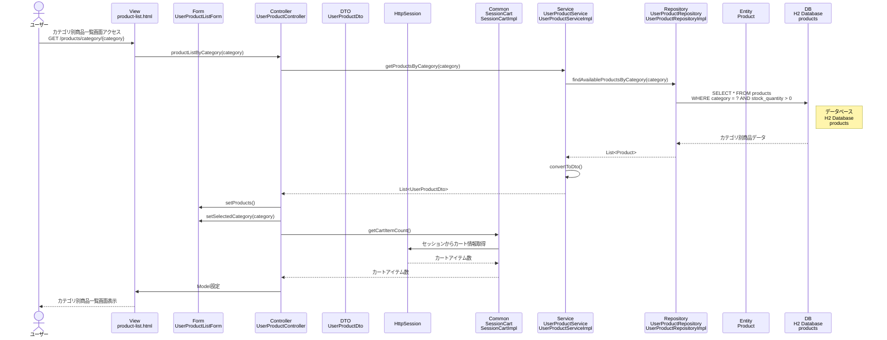

# シーケンス図_カテゴリ別商品表示

## 概要
カテゴリ別商品表示機能のシーケンス図です。ユーザーが特定のカテゴリの商品一覧画面にアクセスした際の処理フローを示します。

## シーケンス図

## 解説

### 処理フロー
1. **ユーザーアクセス**: ユーザーがカテゴリ別商品一覧画面（`/products/category/{category}`）にアクセス
2. **コントローラー処理**: `UserProductController.productListByCategory()`メソッドが実行される
3. **サービス層呼び出し**: `UserProductService.getProductsByCategory()`で指定カテゴリの商品を取得
4. **リポジトリ層呼び出し**: `UserProductRepository.findAvailableProductsByCategory()`で指定カテゴリの在庫のある商品を取得
5. **データベースアクセス**: H2データベースのproductsテーブルから指定カテゴリで在庫数が0より大きい商品を取得
6. **DTO変換**: ProductエンティティをUserProductDtoに変換
7. **フォーム設定**: 取得した商品データをUserProductListFormに設定し、選択されたカテゴリも設定
8. **カート情報取得**: セッションからカートアイテム数を取得
9. **画面表示**: カテゴリ別商品一覧画面を表示

### 主要なクラスと役割
- **UserProductController**: リクエストを受け取り、適切なサービスを呼び出し
- **UserProductService**: ビジネスロジックを実行し、DTO変換を行う
- **UserProductRepository**: データベースアクセスを担当
- **SessionCart**: セッション内のカート情報を管理
- **UserProductListForm**: 画面表示用のフォームデータを保持し、選択されたカテゴリ情報も管理

### 商品一覧表示との違い
- カテゴリパラメータを受け取り、指定されたカテゴリの商品のみを取得
- UserProductListFormに選択されたカテゴリ情報を設定
- 同じ画面テンプレート（product-list.html）を使用するが、表示内容がカテゴリ別に絞り込まれる 