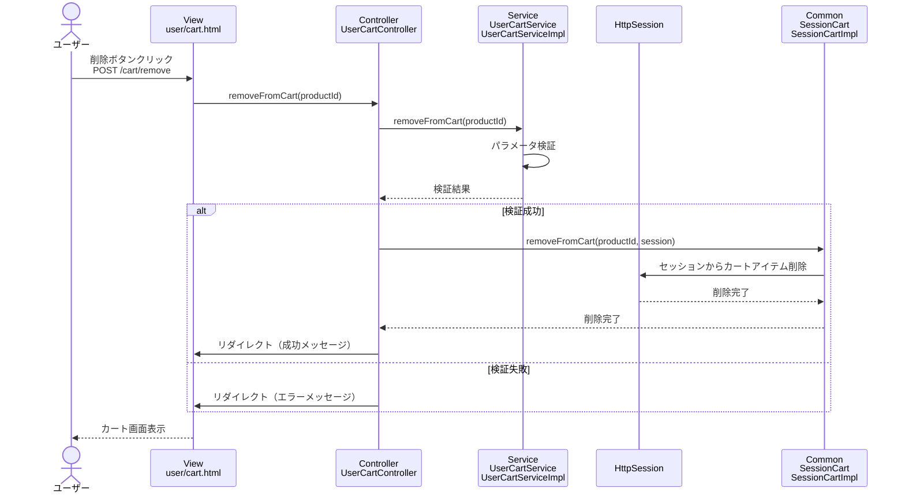

# シーケンス図_カート商品削除

## 概要
カート商品削除機能のシーケンス図です。カートから商品を削除する際の処理フローを示します。

## シーケンス図

## 解説

### 処理フロー
1. **ユーザーアクション**: ユーザーがカート画面で「削除」ボタンをクリック
2. **POSTリクエスト**: 商品IDをPOSTで送信（`/cart/remove`）
3. **コントローラー処理**: `UserCartController.removeFromCart()`メソッドが実行される
4. **サービス層呼び出し**: `UserCartService.removeFromCart()`でビジネスロジックを実行
5. **パラメータ検証**: 商品IDの妥当性をチェック
6. **セッション更新**: 検証成功時、`SessionCart.removeFromCart()`でセッションからカートアイテムを削除
7. **リダイレクト**: 処理結果に応じてカート画面にリダイレクト
8. **画面表示**: 成功/エラーメッセージと共にカート画面を表示

### 主要なクラスと役割
- **UserCartController**: リクエストを受け取り、サービスとセッションを連携
- **UserCartService**: ビジネスロジック（パラメータ検証）を実行
- **SessionCart**: セッション内のカート情報を管理
- **HttpSession**: カート情報の永続化

### 特徴
- シンプルな削除処理
- セッション管理によるカート情報の更新
- リダイレクトによる画面遷移
- フラッシュメッセージによる処理結果の通知
- エラーハンドリングによる適切なフィードバック 