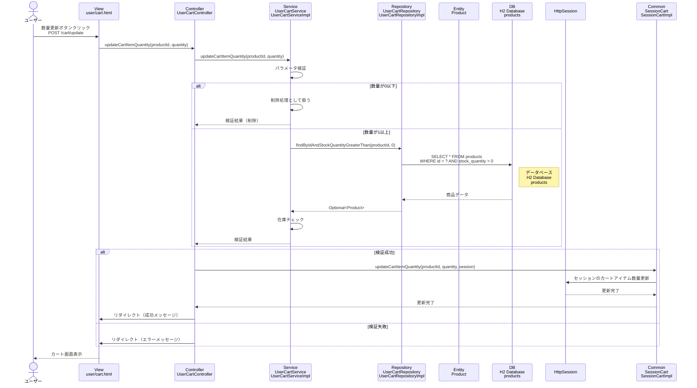

# シーケンス図_カート商品数量更新

## 概要
カート商品数量更新機能のシーケンス図です。カート内の商品数量を更新する際の処理フローを示します。

## シーケンス図

## 解説

### 処理フロー
1. **ユーザーアクション**: ユーザーがカート画面で数量を変更して「更新」ボタンをクリック
2. **POSTリクエスト**: 商品IDと新しい数量をPOSTで送信（`/cart/update`）
3. **コントローラー処理**: `UserCartController.updateCartItemQuantity()`メソッドが実行される
4. **サービス層呼び出し**: `UserCartService.updateCartItemQuantity()`でビジネスロジックを実行
5. **パラメータ検証**: 商品IDと数量の妥当性をチェック
6. **数量判定**: 数量が0以下の場合は削除処理として扱う
7. **在庫チェック**: 数量が1以上の場合は在庫状況をチェック
8. **商品情報取得**: `UserCartRepository.findByIdAndStockQuantityGreaterThan()`で商品情報を取得
9. **データベースアクセス**: H2データベースのproductsテーブルから在庫のある商品を取得
10. **セッション更新**: 検証成功時、`SessionCart.updateCartItemQuantity()`でセッションのカートアイテム数量を更新
11. **リダイレクト**: 処理結果に応じてカート画面にリダイレクト
12. **画面表示**: 成功/エラーメッセージと共にカート画面を表示

### 主要なクラスと役割
- **UserCartController**: リクエストを受け取り、サービスとセッションを連携
- **UserCartService**: ビジネスロジック（パラメータ検証、在庫チェック）を実行
- **UserCartRepository**: 商品情報のデータベースアクセスを担当
- **SessionCart**: セッション内のカート情報を管理
- **HttpSession**: カート情報の永続化

### 特徴
- 数量0以下の場合は削除処理として扱う
- リアルタイムでの在庫状況確認
- セッション管理によるカート情報の更新
- リダイレクトによる画面遷移
- フラッシュメッセージによる処理結果の通知
- エラーハンドリングによる適切なフィードバック 